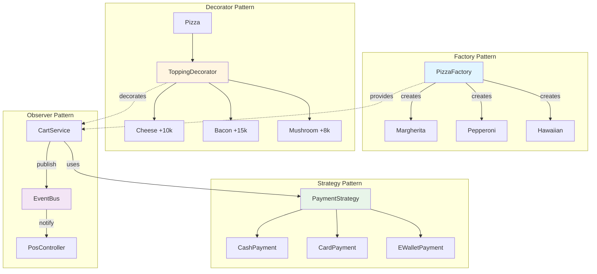
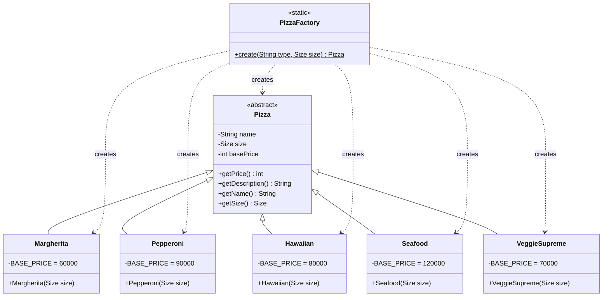
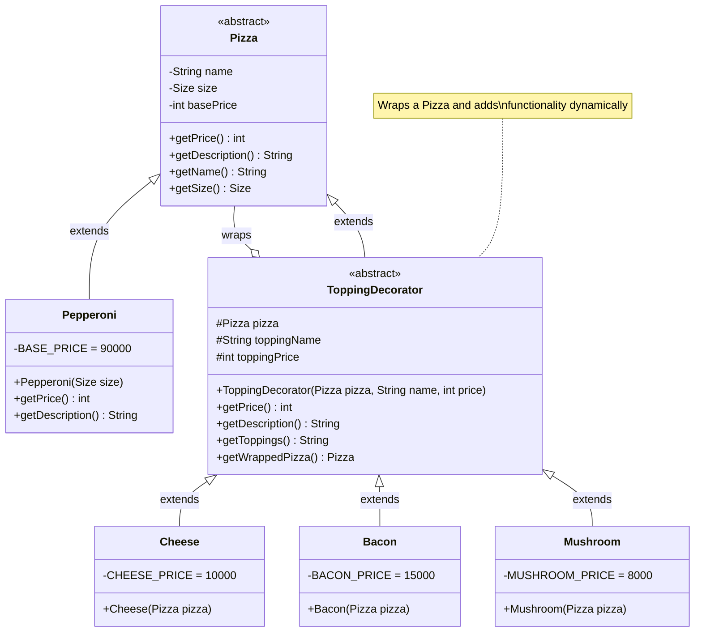
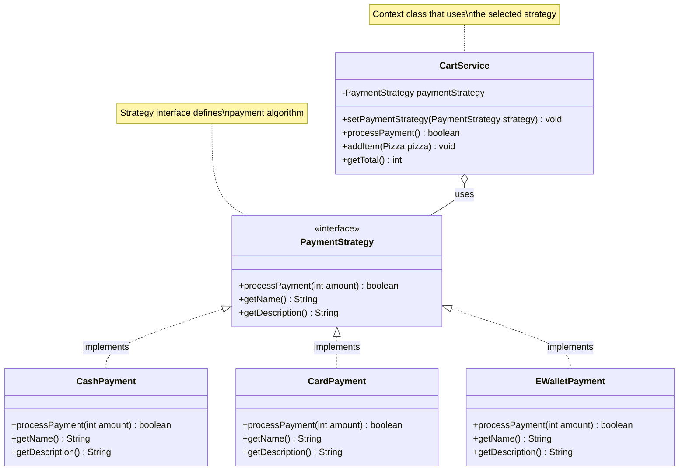
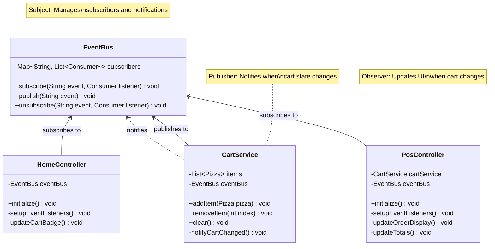
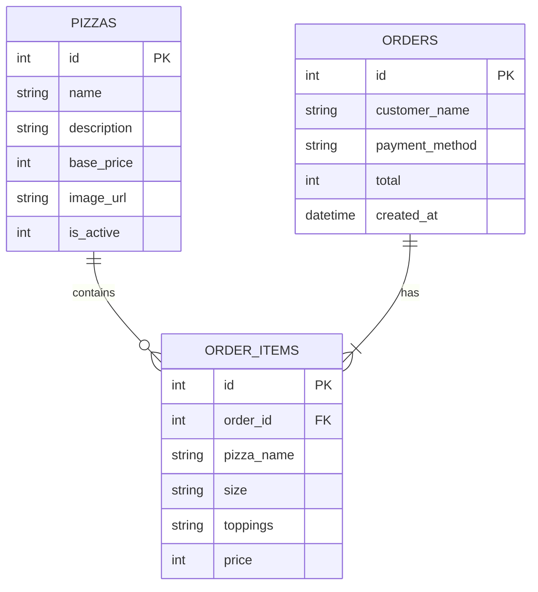

# 🍕 Hệ thống POS (Point of Sale) Pizza


Ứng dụng JavaFX desktop POS chuyên nghiệp cho cửa hàng pizza, minh họa đầy đủ **5 nguyên lý SOLID** và **4 mẫu thiết kế (Design Patterns)** quan trọng.

> 📊 **Repository này chứa Mermaid Class Diagrams** - GitHub sẽ tự động render các sơ đồ đẹp mắt!

## 📋 Mục Lục
- [Giới Thiệu](#giới-thiệu)
- [Công Nghệ Sử Dụng](#công-nghệ-sử-dụng)
- [5 Nguyên Lý SOLID](#5-nguyên-lý-solid)
- [4 Design Patterns](#4-design-patterns)
  - [Architecture Overview](#-architecture-overview---tất-cả-patterns-kết-hợp)
  - [Factory Pattern](#1️⃣-factory-pattern---tạo-đối-tượng-pizza)
  - [Decorator Pattern](#2️⃣-decorator-pattern---thêm-topping-động)
  - [Strategy Pattern](#3️⃣-strategy-pattern---xử-lý-thanh-toán)
  - [Observer Pattern](#4️⃣-observer-pattern---cập-nhật-ui-tự-động)
- [Cấu Trúc Dự Án](#cấu-trúc-dự-án)
- [Database Schema](#-database-schema-sqlite)
- [Hướng Dẫn Chạy](#hướng-dẫn-chạy)
- [Unit Testing](#unit-testing)

---

## 🎯 Giới Thiệu

Đây là hệ thống POS (Point of Sale) tại quầy cho cửa hàng pizza, cho phép nhân viên:
- ✅ Nhận đơn hàng và chọn món
- ✅ Thêm topping động
- ✅ Xử lý thanh toán (Tiền mặt, Thẻ, Ví điện tử)
- ✅ Lưu trữ đơn hàng vào database

**Mục tiêu chính**: Áp dụng đúng và đầy đủ **5 nguyên lý SOLID** và **4 Design Patterns**.

---

## 🛠 Công Nghệ Sử Dụng

- **Java**: 17
- **JavaFX**: 19.0.2.1 (Desktop UI)
- **SQLite**: 3.41.2.2 (Database)
- **JUnit**: 5.9.2 (Testing)
- **Maven**: Quản lý dependenciesimage.png

---

## 🏛️ 5 Nguyên Lý SOLID

### 1️⃣ **SRP - Single Responsibility Principle** (Nguyên lý Trách nhiệm Đơn)
> *Một class chỉ nên có một lý do duy nhất để thay đổi*

#### ✅ Ví dụ trong dự án:

**`PriceCalculator.java`** - Chỉ chịu trách nhiệm tính toán giá
```java
public class PriceCalculator {
    public int calculateSubtotal(List<Pizza> items) { ... }
    public int calculateTax(int subtotal, double taxRate) { ... }
    public int calculateDiscount(int subtotal, double discountPercent) { ... }
}
```
✅ **Tuân thủ SRP**: Class này chỉ lo tính toán giá, không lo UI, không lo database.

**`CartService.java`** - Chỉ quản lý giỏ hàng
```java
public class CartService {
    public void addItem(Pizza pizza) { ... }
    public void removeItem(int index) { ... }
    public int getTotal() { ... }
}
```
✅ **Tuân thủ SRP**: Chỉ quản lý state của giỏ hàng, không lo UI hay thanh toán.

**`OrderRepository.java`** - Chỉ lo lưu trữ database
```java
public class OrderRepository {
    public int saveOrder(...) throws SQLException { ... }
}
```
✅ **Tuân thủ SRP**: Chỉ lo persistence, không lo business logic.

---

### 2️⃣ **OCP - Open/Closed Principle** (Nguyên lý Đóng/Mở)
> *Open for extension, closed for modification - Mở để mở rộng, đóng để sửa đổi*

#### ✅ Ví dụ trong dự án:

**Thêm Payment Method mới KHÔNG cần sửa code cũ**

```java
// Interface không cần sửa
public interface PaymentStrategy {
    boolean processPayment(int amount);
    String getName();
}

// Thêm payment method mới - KHÔNG sửa code cũ
public class BankTransferPayment implements PaymentStrategy {
    @Override
    public boolean processPayment(int amount) {
        // Logic chuyển khoản ngân hàng
        return true;
    }
    
    @Override
    public String getName() {
        return "Bank Transfer";
    }
}
```
✅ **Tuân thủ OCP**: Thêm tính năng mới bằng cách extend, không modify existing code.

**Thêm Pizza mới**
```java
public class VeganPizza extends Pizza {
    public VeganPizza(Size size) {
        super("Vegan Special", size, 85_000);
    }
}
```
✅ Không cần sửa `Pizza.java` hay `PizzaFactory.java` (chỉ thêm case mới).

---

### 3️⃣ **LSP - Liskov Substitution Principle** (Nguyên lý Thay thế Liskov)
> *Các class con phải có thể thay thế class cha mà không làm hỏng chương trình*

#### ✅ Ví dụ trong dự án:

**Tất cả PaymentStrategy đều thay thế được cho nhau**
```java
// Có thể dùng bất kỳ payment method nào
PaymentStrategy payment = new CashPayment();
payment = new CardPayment();      // ✅ Thay thế được
payment = new EWalletPayment();   // ✅ Thay thế được

// Client code không cần thay đổi
boolean success = payment.processPayment(100_000);
```

**Tất cả Pizza subclasses đều thay thế được**
```java
Pizza pizza = new Margherita(Size.M);
pizza = new Pepperoni(Size.L);    // ✅ Thay thế được
pizza = new Hawaiian(Size.S);     // ✅ Thay thế được

// Decorator cũng thay thế được
pizza = new Cheese(pizza);        // ✅ Pizza vẫn là Pizza
```

✅ **Tuân thủ LSP**: Tất cả subclasses/implementations hoạt động giống nhau về mặt interface.

---

### 4️⃣ **ISP - Interface Segregation Principle** (Nguyên lý Phân tách Interface)
> *Không nên ép client phụ thuộc vào interface mà nó không dùng*

#### ✅ Ví dụ trong dự án:

**PaymentStrategy Interface - Nhỏ gọn, chỉ có những method cần thiết**
```java
public interface PaymentStrategy {
    boolean processPayment(int amount);  // Chỉ method cần thiết
    String getName();                     // Chỉ method cần thiết
    String getDescription();              // Chỉ method cần thiết
}
```
✅ **Tuân thủ ISP**: Interface nhỏ, focused. Không có method thừa.

**❌ Vi phạm ISP sẽ như thế nào:**
```java
// BAD EXAMPLE - KHÔNG làm thế này
public interface PaymentStrategy {
    boolean processPayment(int amount);
    void refundPayment(int amount);        // ❌ Không phải tất cả payment cần refund
    void printReceipt();                   // ❌ Print không phải trách nhiệm của Payment
    void sendEmailConfirmation();          // ❌ Email không phải trách nhiệm của Payment
    boolean validateCard();                // ❌ Chỉ Card cần validate
    String generateQR();                   // ❌ Chỉ E-Wallet cần QR
}
```

---

### 5️⃣ **DIP - Dependency Inversion Principle** (Nguyên lý Đảo ngược Phụ thuộc)
> *High-level modules không nên phụ thuộc vào low-level modules. Cả hai nên phụ thuộc vào abstraction*

#### ✅ Ví dụ trong dự án:

**CartService phụ thuộc vào abstraction (PaymentStrategy), KHÔNG phụ thuộc vào concrete classes**

```java
public class CartService {
    // ✅ Depend on abstraction
    private PaymentStrategy paymentStrategy;
    
    // ❌ KHÔNG phụ thuộc trực tiếp vào concrete:
    // private CashPayment cashPayment;
    // private CardPayment cardPayment;
    
    public void setPaymentStrategy(PaymentStrategy strategy) {
        this.paymentStrategy = strategy;
    }
    
    public boolean processPayment() {
        // Dùng abstraction, không biết concrete implementation
        return paymentStrategy.processPayment(getTotal());
    }
}
```

**CartController phụ thuộc vào CartService abstraction**
```java
public class CartController {
    // ✅ Depend on abstraction (service layer)
    private final CartService cartService = CartService.getInstance();
    
    @FXML
    private void handlePlaceOrder() {
        // High-level module (Controller) không quan tâm 
        // low-level details (payment processing logic)
        boolean success = cartService.processPayment();
    }
}
```

✅ **Tuân thủ DIP**: High-level modules (Controller, Service) phụ thuộc vào abstractions, không phụ thuộc vào concrete implementations.

---

## 🎨 4 Design Patterns

### 🏗️ Architecture Overview - Tất cả Patterns kết hợp



---

### 1️⃣ **Factory Pattern** - Tạo đối tượng Pizza

**Vị trí**: `com.pizza.domain.factory.PizzaFactory`

**Vấn đề giải quyết**: Tập trung logic tạo Pizza, client không cần biết concrete class.

```java
// Client code không cần biết concrete class
Pizza pizza = PizzaFactory.create("Margherita", Size.M);

// Factory xử lý logic tạo object
public static Pizza create(String type, Size size) {
    return switch (type.toLowerCase()) {
        case "margherita" -> new Margherita(size);
        case "pepperoni" -> new Pepperoni(size);
        case "hawaiian" -> new Hawaiian(size);
        // ... thêm pizza mới ở đây
        default -> throw new IllegalArgumentException("Unknown pizza");
    };
}
```

**Lợi ích**:
- ✅ Tách biệt creation logic
- ✅ Dễ thêm pizza mới
- ✅ Tuân thủ SOLID (SRP, OCP)

#### 📊 Class Diagram - Factory Pattern



---

### 2️⃣ **Decorator Pattern** - Thêm topping động

**Vị trí**: `com.pizza.domain.decorator.*`

**Vấn đề giải quyết**: Thêm tính năng (topping) vào Pizza mà không sửa class Pizza gốc.

```java
// Tạo pizza cơ bản
Pizza pizza = PizzaFactory.create("Pepperoni", Size.L);
System.out.println(pizza.getPrice());  // 120,000

// Thêm topping động - wrap pizza trong decorators
pizza = new Cheese(pizza);      // +10,000
pizza = new Bacon(pizza);       // +15,000
pizza = new Mushroom(pizza);    // +8,000

System.out.println(pizza.getPrice());        // 153,000
System.out.println(pizza.getDescription());  // "Pepperoni (L) + Extra Cheese + Bacon + Mushroom"
```

**Cấu trúc**:
```java
// Component
public abstract class Pizza {
    public abstract int getPrice();
    public abstract String getDescription();
}

// Concrete Component
public class Pepperoni extends Pizza { ... }

// Decorator
public abstract class ToppingDecorator extends Pizza {
    protected Pizza pizza;
    
    @Override
    public int getPrice() {
        return pizza.getPrice() + toppingPrice;
    }
}

// Concrete Decorators
public class Cheese extends ToppingDecorator { ... }
public class Bacon extends ToppingDecorator { ... }
```

**Lợi ích**:
- ✅ Thêm tính năng runtime
- ✅ Tuân thủ OCP (thêm topping mới không sửa code cũ)
- ✅ Linh hoạt hơn inheritance

#### 📊 Class Diagram - Decorator Pattern



---

### 3️⃣ **Strategy Pattern** - Xử lý thanh toán

**Vị trí**: `com.pizza.domain.strategy.*`

**Vấn đề giải quyết**: Cho phép chọn thuật toán thanh toán (Cash/Card/E-Wallet) tại runtime.

```java
// Interface
public interface PaymentStrategy {
    boolean processPayment(int amount);
    String getName();
}

// Concrete Strategies
public class CashPayment implements PaymentStrategy {
    @Override
    public boolean processPayment(int amount) {
        System.out.println("💵 Cash payment: " + amount);
        return true;
    }
}

public class CardPayment implements PaymentStrategy {
    @Override
    public boolean processPayment(int amount) {
        // Connect to payment gateway
        return true;
    }
}

// Sử dụng
cartService.setPaymentStrategy(new CashPayment());
cartService.processPayment();

// Đổi strategy runtime
cartService.setPaymentStrategy(new CardPayment());
cartService.processPayment();
```

**Lợi ích**:
- ✅ Tách biệt các thuật toán
- ✅ Dễ thêm payment method mới
- ✅ Tuân thủ OCP, DIP

#### 📊 Class Diagram - Strategy Pattern



---

### 4️⃣ **Observer Pattern** - Cập nhật UI tự động

**Vị trí**: `com.pizza.app.EventBus`

**Vấn đề giải quyết**: Khi giỏ hàng thay đổi, tự động cập nhật tất cả UI liên quan.

```java
// EventBus - Subject
public class EventBus {
    private Map<String, List<Consumer<String>>> subscribers;
    
    public void subscribe(String event, Consumer<String> listener) {
        subscribers.computeIfAbsent(event, k -> new ArrayList<>()).add(listener);
    }
    
    public void publish(String event) {
        List<Consumer<String>> listeners = subscribers.get(event);
        listeners.forEach(listener -> listener.accept(null));
    }
}

// Publisher (CartService)
public void addItem(Pizza pizza) {
    items.add(pizza);
    eventBus.publish("CART_UPDATED");  // ✅ Notify observers
}

// Observer (CartController)
eventBus.subscribe("CART_UPDATED", data -> {
    loadCartItems();      // ✅ Auto update UI
    updateTotal();        // ✅ Auto update total
});
```

**Lợi ích**:
- ✅ Loose coupling giữa components
- ✅ UI tự động sync với data
- ✅ Dễ thêm observers mới

#### 📊 Class Diagram - Observer Pattern



---

## 📁 Cấu Trúc Dự Án

```
pizza-pos-system/
├── src/main/java/com/pizza/
│   ├── domain/              # Domain Layer - Business Logic
│   │   ├── pizza/          # Pizza entities (SRP)
│   │   │   ├── Pizza.java           (Abstract base)
│   │   │   ├── Size.java            (Enum)
│   │   │   ├── Margherita.java      ✅ LSP
│   │   │   ├── Pepperoni.java       ✅ LSP
│   │   │   ├── Hawaiian.java        ✅ LSP
│   │   │   ├── Seafood.java         ✅ LSP
│   │   │   └── VeggieSupreme.java   ✅ LSP
│   │   ├── decorator/      # Decorator Pattern
│   │   │   ├── ToppingDecorator.java (Abstract) ✅ OCP
│   │   │   ├── Cheese.java          ✅ OCP
│   │   │   ├── Bacon.java           ✅ OCP
│   │   │   └── Mushroom.java        ✅ OCP
│   │   ├── strategy/       # Strategy Pattern
│   │   │   ├── PaymentStrategy.java (Interface) ✅ ISP, DIP
│   │   │   ├── CashPayment.java     ✅ LSP, OCP
│   │   │   ├── CardPayment.java     ✅ LSP, OCP
│   │   │   └── EWalletPayment.java  ✅ LSP, OCP
│   │   └── factory/        # Factory Pattern
│   │       └── PizzaFactory.java    ✅ SRP, OCP
│   ├── app/                # Application Layer
│   │   ├── EventBus.java        (Observer Pattern)
│   │   ├── CartService.java     ✅ SRP, DIP
│   │   └── PriceCalculator.java ✅ SRP
│   ├── infra/db/           # Infrastructure Layer
│   │   ├── SQLiteConnection.java
│   │   ├── OrderRepository.java ✅ SRP
│   │   └── PizzaRepository.java ✅ SRP
│   └── ui/                 # Presentation Layer
│       ├── MainApp.java
│       ├── Launcher.java
│       └── controllers/
│           ├── HomeController.java   ✅ SRP
│           ├── MenuController.java   ✅ SRP
│           └── CartController.java   ✅ SRP, DIP
├── src/main/resources/
│   ├── views/
│   │   ├── home.fxml
│   │   ├── menu.fxml
│   │   └── cart.fxml
│   └── application.css
└── src/test/java/com/pizza/
    ├── StrategyTest.java        (Test Payment Strategies)
    ├── DecoratorTest.java       (Test Toppings)
    └── PriceCalculatorTest.java (Test Calculations)
```

---

## 🗄️ Database Schema (SQLite)

### ER Diagram



### Bảng `orders` - Clean POS Schema
| Cột | Kiểu | Mô tả |
|-----|------|-------|
| `id` | INTEGER PK | Mã đơn hàng (auto-increment) |
| `customer_name` | TEXT | Tên khách (mặc định "Khách vãng lai") |
| `payment_method` | TEXT | Tiền Mặt / Thẻ / Ví Điện Tử |
| `total` | INTEGER | Tổng tiền đơn hàng |
| `created_at` | DATETIME | Thời gian tạo (auto) |

### Bảng `order_items` - Chi tiết món
| Cột | Kiểu | Mô tả |
|-----|------|-------|
| `id` | INTEGER PK | ID món (auto-increment) |
| `order_id` | INTEGER FK | Tham chiếu đến `orders.id` |
| `pizza_name` | TEXT | Tên pizza gốc (VD: "Pizza Pepperoni") |
| `size` | TEXT | Kích thước: S / M / L |
| `toppings` | TEXT | Danh sách topping (VD: "Phô Mai, Nấm") |
| `price` | INTEGER | Giá cuối cùng (bao gồm topping) |

### Bảng `pizzas` - Menu Pizza
| Cột | Kiểu | Mô tả |
|-----|------|-------|
| `id` | INTEGER PK | ID pizza (auto-increment) |
| `name` | TEXT | Tên pizza |
| `description` | TEXT | Mô tả pizza |
| `base_price` | INTEGER | Giá cơ bản |
| `image_url` | TEXT | URL hình ảnh |
| `is_active` | INTEGER | Trạng thái (1=active, 0=inactive) |

---

## 🚀 Hướng Dẫn Chạy

### Yêu Cầu
- Java JDK 17+
- Maven 3.6+

### Các Lệnh

   ```bash
# Build project
   mvn clean install

# Chạy ứng dụng
   mvn javafx:run

# Chạy tests
mvn test

# Build JAR executable
mvn package
java -jar target/pizza-order-app-1.0-SNAPSHOT.jar
```

---

## 🧪 Unit Testing

### Chạy Tests
```bash
mvn test
```

### Test Coverage

1. **StrategyTest.java** - Test Payment Strategies
   - ✅ Cash, Card, E-Wallet payment processing
   - ✅ Strategy polymorphism (LSP)
   - ✅ Edge cases (zero amount, large amount)

2. **DecoratorTest.java** - Test Topping Decorators
   - ✅ Single topping
   - ✅ Multiple toppings
   - ✅ Price accumulation

3. **PriceCalculatorTest.java** - Test Price Calculations
   - ✅ Single pizza
   - ✅ Multiple pizzas
   - ✅ With decorators
   - ✅ Tax and discount calculations

### Kết Quả Mẫu
```
[INFO] Tests run: 24, Failures: 0, Errors: 0, Skipped: 0
[INFO] BUILD SUCCESS
```

---

## 📊 Tổng Kết SOLID + Design Patterns

| Nguyên Lý SOLID | Ví Dụ Trong Dự Án |
|-----------------|-------------------|
| **SRP** | CartService, PriceCalculator, OrderRepository đều có 1 trách nhiệm duy nhất |
| **OCP** | Có thể thêm Pizza, Topping, Payment mới mà không sửa code cũ |
| **LSP** | Tất cả Pizza/Payment subclasses thay thế được cho base class |
| **ISP** | PaymentStrategy interface nhỏ gọn, không có method thừa |
| **DIP** | Controller/Service phụ thuộc vào abstraction, không phụ thuộc concrete |

| Design Pattern | Mục Đích | Áp Dụng Vào |
|----------------|----------|-------------|
| **Factory** | Tạo Pizza objects | PizzaFactory |
| **Decorator** | Thêm topping động | ToppingDecorator |
| **Strategy** | Chọn payment method | PaymentStrategy |
| **Observer** | Auto-update UI | EventBus |

---

## 💡 Học Hỏi Từ Dự Án

### SOLID Principles giúp gì?
- ✅ **Code dễ maintain**: Mỗi class có trách nhiệm rõ ràng
- ✅ **Code dễ extend**: Thêm tính năng mới không sửa code cũ
- ✅ **Code dễ test**: Classes nhỏ, focused, dễ viết unit test
- ✅ **Code dễ hiểu**: Cấu trúc rõ ràng, logic tách biệt

### Design Patterns giúp gì?
- ✅ **Giải quyết vấn đề phổ biến**: Đã được kiểm chứng
- ✅ **Communication**: Dev hiểu nhau qua tên pattern
- ✅ **Best practices**: Code professional, maintainable

---

## 👨‍💻 Tác Giả

**Đỗ Trung Tú - 2212485**

Dự án POS Pizza - Minh họa đầy đủ SOLID Principles và Design Patterns trong Java.

---

## 📝 Ghi Chú

- Đây là hệ thống POS tại quầy (không phải e-commerce)
- Database SQLite được tạo tự động khi chạy lần đầu
- UI được tối ưu cho nhân viên thu ngân sử dụng
- Code được document chi tiết với SOLID principles

---

## 📊 Về Class Diagrams

### Xem trên GitHub
📌 **Tất cả diagrams trong README này sử dụng Mermaid**  
✅ GitHub tự động render Mermaid diagrams thành hình ảnh đẹp mắt  
🎨 Bao gồm:
- **Architecture Overview**: Tổng quan tất cả patterns
- **Factory Pattern Diagram**: Cấu trúc PizzaFactory
- **Decorator Pattern Diagram**: Cách topping wrap Pizza
- **Strategy Pattern Diagram**: Payment strategies
- **Observer Pattern Diagram**: EventBus notification flow
- **Database ER Diagram**: Schema database

### Xem Offline
Nếu xem trên IDE (VSCode, IntelliJ):
1. Cài extension hỗ trợ Mermaid
2. Hoặc copy code Mermaid vào [Mermaid Live Editor](https://mermaid.live/)

---

**🍕 Chúc bạn học tốt SOLID và Design Patterns! 🍕**

---

## 📄 License

MIT License - Dự án mã nguồn mở cho mục đích học tập.

**Made with ❤️ by Đỗ Trung Tú - 2212485**
